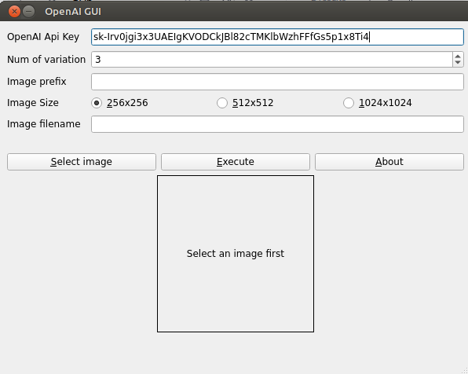

# Basic GUI to use OpenAI 



## Motivation

Some time ago, I did some testing of image variations with OpenAPI with a [ink sketch](images/sketch.png) I did some years ago (is quite easy to identify the original). 

I showed the generated image to my brother and ask him to find which image is the original.

Recently, my brother needed to generate some image variations for their projects, and as he don't know Python, programming or API stuffs, 
he asked me if I could make them for him, and I did it.

Then, I made this basic GUI for this task.

This program/GUI is pretty basic, but functional 


Some references 
- [OpenAI Image variation](https://platform.openai.com/docs/guides/images/variations)
- [OpenAI Image variation - API](https://platform.openai.com/docs/api-reference/images/create-variation)


## Usage

1. Create an account in OpenAI
2. Get an Api Key https://platform.openai.com/docs/api-reference/authentication
2. Open program 
3. Fill **"OpenAI Api Key"** with your api key (after a succesful execution will be saved to "config.json")
4. Select an image (**Select image**)
5. Choose number of variation to generate (**Num of variation**)
6. Choose ouput image size (**Image Size**)
7. Optional add a **Image prefix** 
5. Presss **Execute**

Variation images will be copied to folder **variations** as **\<prefix\>_\<image filename\>_\<remote_filename\>.png**


## About the program

If you want to build the program: 

- Install [Python 3.x](https://www.python.org/downloads/)
- Create a virtualenv, activate and install the [requirements](requirements.txt)
  ```
  python -m venv venv
  source venv/bin/activate
  python -m pip install --upgrade pip
  pip install -r requirements.txt
  ```
  (*) For Windows users use *venv\Scripts\activate* 

- Build binary, executing:
  - Windows
    ```
    pyinstaller --clean --onefile  --noconsole --windowed --name "OpenAI_GUI"  --icon=images/logo.ico  --add-data="images/*;images/" gui_openai.py
    ```
  - Linux
  ```
  pyinstaller --clean --onefile  --noconsole --windowed --name "OpenAI_GUI"  --icon=images/logo.ico  --add-data="images/*:images/" gui_openai.py
  ```
  
Check binary in **dist** folder

